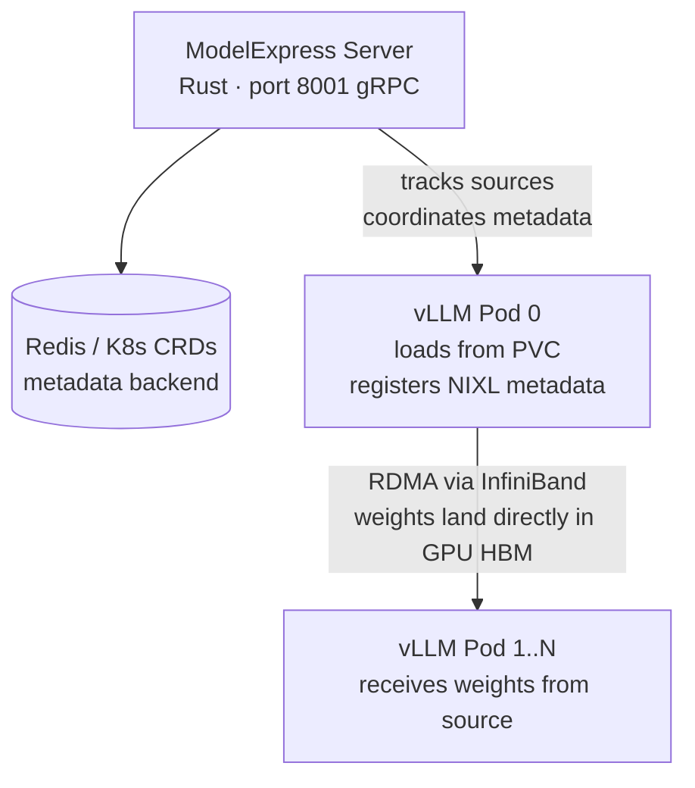

<!--
SPDX-FileCopyrightText: Copyright (c) 2025-2026 NVIDIA CORPORATION & AFFILIATES. All rights reserved.
SPDX-License-Identifier: Apache-2.0
-->

# ModelExpress — vLLM Integration Guide

## How it works

When you add ModelExpress to vLLM, it replaces the normal weight-loading path.
Instead of every vLLM pod independently loading model weights from disk, the
`modelexpress` loader:

1. Queries the ModelExpress gRPC server: "is there already a loaded source for this model?"
2. **If yes** — receives weights directly into GPU HBM via RDMA (no disk I/O on this pod)
3. **If no** — loads from disk as normal, then registers itself as a source for future pods

The two key changes in vLLM are `--load-format modelexpress` and `VLLM_PLUGINS=modelexpress`.



---

## Prerequisites

| Requirement | Notes |
|---|---|
| Kubernetes 1.25+ | |
| Helm 3.10+ | |
| NVIDIA GPU Operator | Installs device plugin, drivers, CUDA |
| Network Operator | Installs RDMA device plugin, Mellanox OFED |
| `rdma/ib` resource on nodes | Verify: `kubectl get node -o json \| jq '.items[].status.allocatable["rdma/ib"]'` |
| NGC API key | To pull `nvcr.io/nvidia/ai-dynamo/modelexpress-server` |
| PVC with model weights | Or use `modelexpress-cli model download` after deployment |

---

## Part 1 — Deploy the ModelExpress server

### Step 1 — Namespace and pull secret

```bash
export NAMESPACE=inference
export NGC_API_KEY=your_ngc_api_key

kubectl create namespace $NAMESPACE

kubectl create secret docker-registry nvcr-secret \
  --docker-server=nvcr.io \
  --docker-username='$oauthtoken' \
  --docker-password=$NGC_API_KEY \
  -n $NAMESPACE
```

The chart's default `imagePullSecrets` references the name `nvcr-secret`. If you
use a different name, override `imagePullSecrets[0].name` in your values file.

### Step 2 — Install CRDs (cluster-admin, one-time per cluster)

The ModelExpress CRDs (`ModelMetadata`, `ModelCacheEntry`) are not bundled in the
Helm chart templates because Helm upgrade would otherwise attempt to delete them.
Apply them once from the repo:

```bash
# From the root of the modelexpress repo checkout
kubectl apply -f examples/crds.yaml
```

Verify:

```bash
kubectl get crd | grep modelexpress.nvidia.com
```

### Step 3 — Install via Helm

The chart lives in `helm/` inside the repo. All server configuration is driven
by `helm/values.yaml` (defaults) plus a values overlay of your choice.

**Kubernetes backend (default — no external dependencies):**

```bash
helm install modelexpress ./helm \
  --namespace $NAMESPACE \
  --values helm/values.yaml
```

`values.yaml` defaults to `MX_METADATA_BACKEND=kubernetes` with
`serviceAccount.rbac.enabled=true`, so the chart creates the Role and
RoleBinding automatically — no separate RBAC manifest needed.

**Redis backend (recommended for RL / live fine-tune workloads):**

Deploy Redis first, then install with the production values overlay:

```bash
helm repo add bitnami https://charts.bitnami.com/bitnami
helm repo update

helm install redis bitnami/redis \
  --namespace $NAMESPACE \
  --set auth.enabled=false

helm install modelexpress ./helm \
  --namespace $NAMESPACE \
  --values helm/values.yaml \
  --values helm/values-production.yaml
```

`values-production.yaml` sets `MX_METADATA_BACKEND=redis`,
`REDIS_URL=redis://redis-master:6379`, and production-grade resource limits.
Adjust `persistence.storageClass`, `ingress.hosts`, and `nodeSelector` to match
your cluster.

**Verify:**

```bash
kubectl -n $NAMESPACE rollout status deployment/modelexpress
kubectl -n $NAMESPACE get pod -l app.kubernetes.io/name=modelexpress
```

### Step 4 — Optional: pre-download a model onto the PVC

After port-forwarding to the server:

```bash
kubectl port-forward -n $NAMESPACE svc/modelexpress 8001:8001 &

modelexpress-cli \
  --endpoint http://localhost:8001 \
  model download your-org/your-model
```

Or create a HuggingFace token secret and pass it to the chart so the server can
pull gated models on startup:

```bash
kubectl create secret generic hf-token-secret \
  --from-literal=HF_TOKEN=your_hf_token \
  -n $NAMESPACE
```

Then add to your values overlay (the `extraEnv` block is already commented out
as a ready-to-use template in `values.yaml`):

```yaml
extraEnv:
  - name: HF_TOKEN
    valueFrom:
      secretKeyRef:
        name: hf-token-secret
        key: HF_TOKEN
```

---

## Part 2 — Add ModelExpress to vLLM

### Step 5 — Build the combined image

The vLLM container needs the `modelexpress` Python package installed on top of
the base vLLM image. Build and push it to your registry:

```bash
docker build \
  -f examples/p2p_transfer_k8s/client/vllm/Dockerfile \
  -t your-registry/mx-vllm:0.3.0 .

docker push your-registry/mx-vllm:0.3.0
```

The Dockerfile installs the ModelExpress Python client (`modelexpress_client/python`)
on top of `vllm/vllm-openai`. Pin the vLLM base tag to match your current deployment.

### Step 6 — Deploy vLLM

Create a Deployment and Service for your vLLM workload. The mandatory changes
from a standard vLLM Deployment are highlighted in the comments below.

**Single-node (TP=8, 1×8 GPUs):**

```yaml
apiVersion: v1
kind: Service
metadata:
  name: mx-vllm
  namespace: inference
spec:
  type: ClusterIP
  ports:
    - port: 8000
      targetPort: 8000
  selector:
    app: mx-vllm
---
apiVersion: apps/v1
kind: Deployment
metadata:
  name: mx-vllm
  namespace: inference
spec:
  replicas: 1
  selector:
    matchLabels:
      app: mx-vllm
  template:
    metadata:
      labels:
        app: mx-vllm
    spec:
      imagePullSecrets:
        - name: nvcr-secret
      containers:
        - name: vllm
          image: your-registry/mx-vllm:0.3.0
          imagePullPolicy: IfNotPresent
          securityContext:
            capabilities:
              add:
                - IPC_LOCK     # required for GPUDirect RDMA memory pinning
          env:
            - name: VLLM_PLUGINS
              value: "modelexpress"                 # register the mx loader
            - name: MX_SERVER_ADDRESS
              value: "modelexpress:8001"            # Helm service name:port
            - name: MX_RDMA_NIC_PIN
              value: "auto"                         # NUMA-local NIC pinning (UCX #11259)
            - name: UCX_RNDV_SCHEME
              value: "get_zcopy"
            - name: UCX_RNDV_THRESH
              value: "0"
            - name: VLLM_RPC_TIMEOUT
              value: "7200000"                      # 2-hour timeout for large-model startup
            - name: HF_HUB_CACHE
              value: "/models"
            - name: POD_IP
              valueFrom:
                fieldRef:
                  fieldPath: status.podIP
            - name: POD_NAMESPACE
              valueFrom:
                fieldRef:
                  fieldPath: metadata.namespace
            - name: NODE_NAME
              valueFrom:
                fieldRef:
                  fieldPath: spec.nodeName
            - name: HF_TOKEN
              valueFrom:
                secretKeyRef:
                  name: hf-token-secret
                  key: HF_TOKEN
          args:
            - --model
            - your-org/your-model
            - --load-format
            - modelexpress
            - --tensor-parallel-size
            - "8"
          resources:
            limits:
              nvidia.com/gpu: "8"
              rdma/ib: "8"
            requests:
              nvidia.com/gpu: "8"
              rdma/ib: "8"
              memory: "200Gi"
              cpu: "16"
          volumeMounts:
            - name: shm
              mountPath: /dev/shm
            - name: model-cache
              mountPath: /models
      volumes:
        - name: shm
          emptyDir:
            medium: Memory
            sizeLimit: 64Gi
        - name: model-cache
          persistentVolumeClaim:
            claimName: your-model-pvc
```

Apply it:

```bash
kubectl apply -f vllm-deployment.yaml
```

### Step 7 — Scale up — zero-cost replicas

```bash
kubectl -n $NAMESPACE scale deployment/mx-vllm --replicas=4
```

Pod 0 loaded from disk and published its NIXL metadata. Pods 1–3 find it as a
source and receive all weights over InfiniBand RDMA. For DeepSeek-V3 (671B),
disk load takes ~40 min; RDMA transfer takes ~4 min.

---

## InfiniBand tuning reference

| Env var | Recommended value | Why |
|---|---|---|
| `UCX_RNDV_SCHEME` | `get_zcopy` | Zero-copy RDMA reads instead of send/recv |
| `UCX_RNDV_THRESH` | `0` | Force rendezvous protocol for every tensor |
| `MX_RDMA_NIC_PIN` | `auto` | Binds each GPU rank to its NUMA-local IB NIC (UCX bug #11259 workaround) |
| `MX_VMM_ARENA` | `1` | Registers the entire weight arena as a single NIXL MR via dmabuf — eliminates per-tensor registration overhead |
| `UCX_CUDA_COPY_REG_WHOLE_ALLOC` | `off` | Required with `MX_VMM_ARENA=1` until the upstream UCX fix ships |
| `MX_POOL_REG` | `1` | Alternative to VMM arena: deduplicates cudaMalloc blocks. Use one or the other. |
| `MX_NIXL_BACKEND` | `UCX` (default) | For IB / RoCE. Use `LIBFABRIC` on AWS EFA. |
| `MX_METADATA_PORT` | `5555` | Fixed NIXL listen port per rank. Required in K8s (ephemeral port 0 is not routable across pods). |
| `MX_WORKER_GRPC_PORT` | `6555` | Fixed worker gRPC port. Same reason. |

---

## Choosing a metadata backend

| Workload | Backend | Reason |
|---|---|---|
| Stable weights, simple scaling | `kubernetes` (CRDs) | No Redis, lowest footprint |
| RL rollouts / live fine-tune | `redis` | Tracks each worker's state individually |
| Mixed-version fleet | `redis` or `kubernetes` | Multiple `mx_source_id` coexist cleanly |
| Fixed weights, serverless-style pods | `k8s-service` | No MX server, no Redis, no CRDs — kube-proxy routes directly |

---

## Helm values reference

All knobs are documented in `helm/values.yaml`. Common overrides:

| Values key | Default | Notes |
|---|---|---|
| `image.tag` | `0.3.0` | Server image tag on NGC |
| `replicaCount` | `1` | Use `3` in production (`values-production.yaml`) |
| `env.MX_METADATA_BACKEND` | `kubernetes` | Set to `redis` and add `env.REDIS_URL` for Redis |
| `persistence.storageClass` | `""` (cluster default) | Set to your fast-SSD class in production |
| `persistence.size` | `10Gi` | Increase for large model caches |
| `serviceAccount.rbac.enabled` | `true` | Creates Role+RoleBinding for CRD access |
| `extraEnv` | `[]` | Inject `HF_TOKEN` / `NGC_API_KEY` from secrets here |
| `resources` | 200m/128Mi | `values-production.yaml` raises to 2000m/2Gi |

To upgrade after changing values:

```bash
helm upgrade modelexpress ./helm \
  --namespace $NAMESPACE \
  --values helm/values.yaml \
  --values helm/values-production.yaml
```

---

## Troubleshooting

```bash
# Is the server healthy?
kubectl logs -n $NAMESPACE -l app.kubernetes.io/name=modelexpress --tail=50

# Which models are cached?
kubectl port-forward -n $NAMESPACE svc/modelexpress 8001:8001 &
modelexpress-cli --endpoint http://localhost:8001 model list

# Is RDMA transfer happening?
kubectl logs -n $NAMESPACE -l app=mx-vllm --tail=100 | grep -i "rdma\|nixl\|transfer"

# Enable UCX/NIXL debug logging
kubectl set env deployment/mx-vllm \
  UCX_LOG_LEVEL=DEBUG \
  NIXL_LOG_LEVEL=DEBUG \
  -n $NAMESPACE

# Flush Redis on redeploy (stale metadata causes P2P transfer failures)
kubectl exec -n $NAMESPACE redis-master-0 -- redis-cli FLUSHALL

# Check RBAC is present (required for kubernetes backend)
kubectl get role,rolebinding -n $NAMESPACE -l app.kubernetes.io/name=modelexpress
```

For RDMA diagnostics set `UCX_LOG_LEVEL=DEBUG` and look for
`rdma_connect` / `am_bcopy` lines in the vLLM pod logs.
